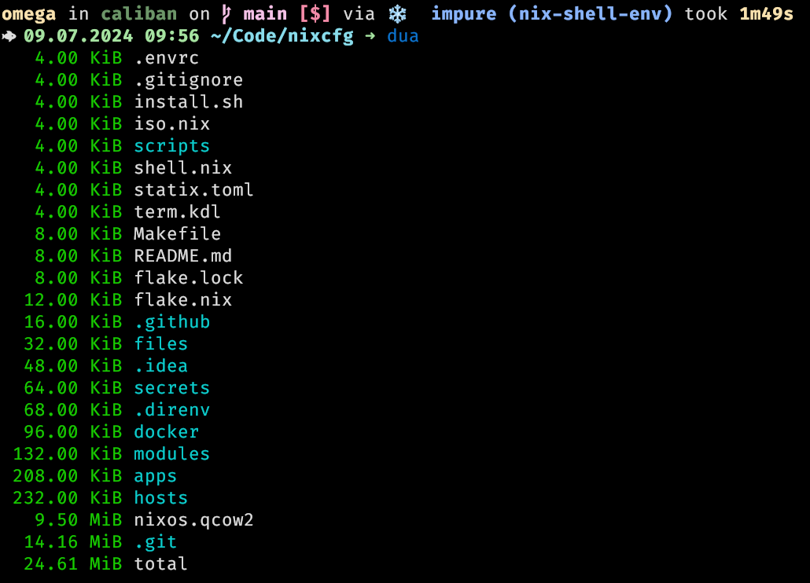
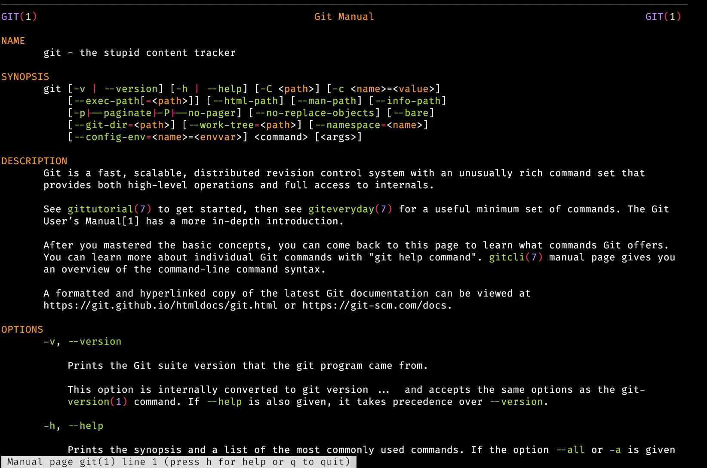

# Modern CLI Tools

Modern tools, that can make your life easier and more productive

---

# [duf](https://github.com/muesli/duf)

Replacement for `df` (disk free)


---

# [dua](https://github.com/Byron/dua-cli)

Replacement for `du` (disk usage)
`dua interactive` for an interactive mode, like `ncdu`



---

# [dust](https://github.com/bootandy/dust)

"`du` + rust = `dust`. Like `du` but more intuitive."


---

# [erdtree](https://github.com/solidiquis/erdtree)

"Modern, cross-platform, multi-threaded, and general purpose filesystem and disk-usage utility"


---

# [ripgrep](https://github.com/BurntSushi/ripgrep)

Very fast replacement for `grep`


---

# [eza](https://github.com/eza-community/eza)

Replacement for `ls` with more colors


---

# [bat](https://github.com/sharkdp/bat)

Replacement for `less` with syntax highlighting


---

# [batman](https://github.com/eth-p/bat-extras/blob/master/doc/batman.md)

Replacement for `man` with `bat` for syntax highlighting



---

# [btop](https://github.com/aristocratos/btop)

Another `top` alternative


---

# [tldr](https://github.com/tldr-pages/tldr)

Collaborative cheatsheets for console commands


---

# [fd](https://github.com/sharkdp/fd)

Fast and user-friendly replacement for `find`


---

# [difftastic](https://github.com/Wilfred/difftastic)

Structural diff tool that compares files based on their syntax


---

# [zellij](https://github.com/zellij-org/zellij)

Replacement for `screen` and `tmux` that allows copying from panels and has sane shortcuts


---

# [lazygit](https://github.com/jesseduffield/lazygit)

The best git TUI I know, better than most commercial GUIs
Watch [15 Lazygit Features In Under 15 Minutes](https://www.youtube.com/watch?v=3Kq1MIfTWCE)


---

# [lazydocker](https://github.com/jesseduffield/lazydocker)

A simple terminal UI for both docker and docker-compose


---

# [broot](https://github.com/Canop/broot)

Fast directory switcher with search
Has `br` alias for changing into directories


---

# [yazi](https://github.com/sxyazi/yazi)

"Blazing Fast Terminal File Manager"
I use a `yy` [alias](https://github.com/pbek/nixcfg/blob/36b6818478eed2813293ee258afd12a45543fcd9/modules/mixins/common.nix#L203-L215) for changing into directories


---

# [zoxide](https://github.com/ajeetdsouza/zoxide)

A smarter `cd` command that learns your habits


---

# [fzf](https://github.com/junegunn/fzf)

A command-line fuzzy finder, for example `find * -type f | fzf`


---

# [sysz](https://github.com/joehillen/sysz)

An `fzf` terminal UI for `systemctl`

[](https://asciinema.org/a/BLsJz73uF7DdQj7FVGqLPhqCa)

---

# [ouch](https://github.com/ouch-org/ouch)

Painless compression and decompression in the terminal (`tar`, `zip`, `gzip`, `bzip2`, `xz`, `7z`, `rar`, ...)

```bash
# Compress two files into `archive.zip`
ouch compress one.txt two.txt archive.zip

# Decompress a file
ouch decompress archive.zip

# List the contents of a compressed file
ouch list archive.zip
```

---

# [procs](https://github.com/dalance/procs)

A modern replacement for ps


---

# [qc](https://github.com/qownnotes/qc)

[QOwnNotes](https://github.com/pbek/QOwnNotes) command-line snippet manager from Markdown files


